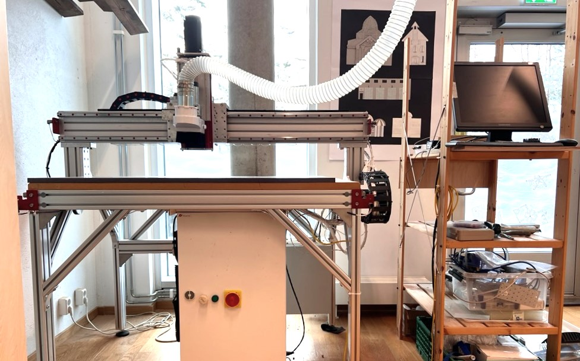
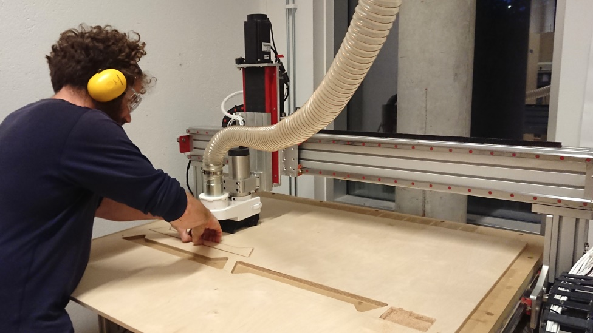

# Tangenåsen CNC
*Dokumentasjon av CNC fresen på Tangenåsen makerspace - AvidCNC 4x2. Skrevet av Jens Dyvik, Februar - Juni 2024*

## Indeks

- [Hva er en CNC fres](https://github.com/JensDyvik/Tangenaasen-CNC/tree/main#hva-er-en-cnc-fres)
- [Sikkerhet](https://github.com/JensDyvik/Tangenaasen-CNC/tree/main#sikkerhet)
- [Sjekkliste](https://github.com/JensDyvik/Tangenaasen-CNC/tree/main#sjekkliste)
- [CAM programmer](https://github.com/JensDyvik/Tangenaasen-CNC/tree/main#cam-programmer)
- [Innstillinger fresestål startpakke](https://github.com/JensDyvik/Tangenaasen-CNC/tree/innstillinger-fresest%C3%A5l-startpakke)
- [Avansert bruk](https://github.com/JensDyvik/Tangenaasen-CNC/tree/main#avansert-bruk)
- [Om maskinen](https://github.com/JensDyvik/Tangenaasen-CNC/tree/main#om-maskinen)
- [Vedlikeholdsrutiner](https://github.com/JensDyvik/Tangenaasen-CNC/tree/main#vedlikeholdsrutiner)
- [To do på maskinen](https://github.com/JensDyvik/Tangenaasen-CNC/tree/main#to-do-på-maskinen)

*CNC fresen på Tangenåsen blir brukt til å lage møbeldeler i kryssfiner*

*Nærbilde av CNC fresing fra [Popular woodworking](https://www.popularwoodworking.com/techniques/feeds-speeds-for-cnc-routers/)*

## Hva er en CNC fres

En CNC fres er en automatisk maskin som skjærer ut en form fra et materiale med en spinnende kniv *(fresestål)*. Den kan for eksempel brukes til å skjære ut deler til møbler, former til kunstverk, støpemaler og mye mer.

For å kunne lage en del med en CNC fres må man først lage en 2D eller 3D tegning i et digitalt tegneprogram *(det er også mulig å 2D scanne håndtegninger og 3D skanne figurer)*. Deretter konverterer man tegningen sin til en jobb for maskinen med et CAM program.

Man kan tenke på en CNC fres som en omvendt 3D printer, som fjerner materiale lag for lag, istedenfor for å bygge opp objektet lag for lag. Sammenlignet med en 3D printer jobber en CNC fres mye raskere og mer presist i flere forskjellige materialer *(treverk, plast, aluminium, messing og mer)*. Men det er litt mer krevende å sette opp en jobb for en CNC fres og det er litt flere geometriske begrensinger *(indre hjørner får fresestålets diameter og ingen overheng mulig)*. For å lage mer komplekse 3D former er det mulig å snu emnet og jobbe fra to eller flere sider.

**Videre ressurser om fresing:**

 - Wikipedia sin [side](https://en.wikipedia.org/wiki/CNC_router) om CNC rutere
 - Fellesverkstedet sin [guide](https://fellesverkstedet.notion.site/CNC-c8a862efdc5a490c9c88aebecad0ac88) til CNC fresing

## Sikkerhet

**Mens du freser:**

- Ta aldri på maskinen eller materialet mens maskinen går
- Forlat aldri maskinen mens den går
- Bruk vernebriller
- Bruk hørselsvern
- Ha på støvavsuget
- Pass på at materialet du freser i er godt festet til sengen på maskinen

## Sjekkliste

- Start PlanetCNC styringsprogrammet
- Varm opp spindelen *(kjør spindelen i luften i noen minutter)*
- Fest materialet til sengen
- Sett opp riktig skjæredybde, bit type og hastighet i CAM
- Home maskinen *(lokasjon av knappen i programmet er markert på venstre kant av skjermen)*
- Sett i riktig bit
- Koble til bit proben og probe bit lengden *(lokasjon av knappen i programmet er markert på venstre kant av skjermen)*
- Koble fra bit proben
- Sjekk "work coordinates" og sett evt. ønsket nullpunkt for X og Y
- Sett på støvskjørtet og start avsuget
- Åpne jobben og start

Husk å forlate maskinen ryddigere enn du fant den.

## CAM programmer

CAM er navnet på programmer som man bruker for å konvertere en 2D eller 3D tegning til en jobb for maskinen *(en rute som fresestålet skal følge)*. Man importerer tegningen sin i et CAM program og eksporterer ut en jobb for maskinen *(G-Code)*

**Gratis enkel CAM i nettleseren:**

 - [OpenBuildsCAM](https://cam.openbuilds.com/) *([InkScape](https://inkscape.org/) er et fint tegneprgam for å lage tegninger som kan importeres in OpenBuildsCAM)*
 
 **Gratis avansert CAM i 3D tegneprogram:**
 
 - [FreeCAD](https://www.freecadweb.org/) *(Krevende å starte med, men kraftig og open source*)
 - [BarkBeetle](https://github.com/fellesverkstedet/Bark-beetle-parametric-toolpaths) *(krever at man har lisens på Rhino3D, en ferdig konfigurert versjon av BarkBeetle for AvidCNC maskinen på er publisert [her](https://github.com/JensDyvik/Tangenaasen-CNC/tree/main/Bark%20Beetle%20CAM%20-%20for%20Rhino))*
 - [Fusion360](https://www.google.com/url?sa=t&rct=j&q=&esrc=s&source=web&cd=&cad=rja&uact=8&ved=2ahUKEwi71tWk-suDAxXpAhAIHec7BYoQFnoECBQQAQ&url=https%3A%2F%2Fwww.autodesk.com%2Fproducts%2Ffusion-360%2Fpersonal&usg=AOvVaw2Qpz756Hs5P4X8QVNBXLeT&opi=89978449) *(veldig kraftig og populært, men har mange begrensninger i gratis versjonen)*

**Bra CAM for nybegynnere:**

- [VCarve Pro Makerspace edition](https://www.vectric.com/products/makerspace) *(Har årlig gruppe abonnement for makerspace. Er veldig populært på makerspaces som bitraf og Fellesverkstedet.)*

## Innstillinger for fresestål startpakke

*Passende plungerate er ca 2/3 av feedrate*

**Treverk:**

- 2mm downcut, ett skjær - Feedrate: 1050mm/m, Passdepth: 2mm, Spindel RPM: 16000
- 3mm upcut, ett skjær - Feedrate: 1600mm/m, Passdepth: 6mm, Spindel RPM: 16000
- 4mm upcut, ett skjær - Feedrate: 2100mm/m, Passdepth: 9mm, Spindel RPM: 16000
- 6mm upcut, ett skjær - Feedrate: 3200mm/m, Passdepth: 14mm, Spindel RPM: 16000
- 6mm compression, ett skjær - Feedrate: 3200mm/m, Passdepth: 14mm, Spindel RPM: 16000 *(Husk ramp angle på 45 grader med compression bit, ikke mos rett ned i materialet)*
- 10mm upcut, to skjær - Feedrate: 8000mm/m, Passdepth: 10mm, Spindel RPM: 12000
- 10mm ballnose, to skjær - Feedrate: 8000mm/m, Passdepth: 6mm, Spindel RPM: 12000

**Plast:**

- 3mm upcut, ett skjær - Feedrate: 1100mm/m, Passdepth: 3mm, Spindel RPM: 16000
- 4mm upcut, ett skjær - Feedrate: 1400mm/m, Passdepth: 4mm, Spindel RPM: 16000
- 6mm upcut, ett skjær - Feedrate: 2100mm/m, Passdepth: 6mm, Spindel RPM: 16000

**Aluminium**

- 3mm upcut, ett skjær - Feedrate: 640mm/m, Passdepth: 0.3mm, Spindel RPM: 16000 *(Husk ramp angle på 8 grader, ikke mos rett ned i materialet)*
- 4mm upcut, ett skjær - Feedrate: 850mm/m, Passdepth: 0.4mm, Spindel RPM: 16000 *(Husk ramp angle på 8 grader, ikke mos rett ned i materialet)*
- 6mm upcut, ett skjær - Feedrate: 1280mm/m, Passdepth: 0.5mm, Spindel RPM: 16000 *(Husk ramp angle på 8 grader, ikke mos rett ned i materialet)*

## Avansert bruk

 - Gantry squaring rutinen er i menyen øverst på skjermen: Machine- Measure- Gantry Square. *(Gantry squaring kan brukes til å automatisk rette opp traversen på maskinen, slik at kutt blir vinkelrette. Traversen kan bli skjev om den f.eks blir dyttet på den ene siden mens den er avskrudd)*
 - Tosidig fresing: For registrere emner når man skal frese fra to sider kan man lage hull for to møbelplugger i offerplaten til sengen og i emnet.

## Om maskinen

Maskinen ble kjøpt brukt høsten 2023. De mekaniske delene er fra et byggesett av typen ["PRO4824 4' x 2' CNC Router Machine"](https://www.avidcnc.com/pro4824-4-x-2-cnc-router-machine-p-1334.html) fra AvidCNC i USA. Styringen er av typen [CNC USB controller Mk3](https://planet-cnc.com/hardware/) fra PlanetCNC i Tyskland. Motorene, driverene, spindelen og frekvensomformeren er fra diverse kinesiske produsenter. Elektronikkskapet er bygget som et gjør-det-selv prosjekt av tidligere eier.

 - Arbeidsområde X-Y: 1220mm x ca 590mm
 - Vandring på Z akse: Ca 180mm *(det er mulig å skjære igjennom opptil ca 80mm tykke emner)*
 - Maks spindle turtall: 16500 RPM
 - Spindel effekt: ca 2kw
 - Type trinnmotorer: Nema34 closed loop *(mer enn nok skyvekraft)*
 - Lineærføringer: HGR15 linear rail *(billig type)*
 - Framdrift X-Y: Rack and pinion with 3:1 belt reduction and spring preoloaded pinon position
 - Framdrift Z: Kuleskrue

## Vedlikeholdsrutiner

**En gang i måneden:**

- Rense spindelkon for støv
- Rengjør maskinen grundig for støv og spon
- Sjekk X og Y akse for slark og evt. etterstram den fjærbelastede skruen som presser tannhjulet mot tannstangen

**En gang i året:**

- Legg på smørefett på rack *(tannstang*). Traversaksen *(broen)* og høyre og venstre side av sengen.
- Pump smørefett i blokkene til ineærføringene på alle akser

**Ved behov:**

- Planere offerplaten
- Lim på ny offerplate

## To do på maskinen

 - Forbedre maskin sikkerhet. E-stop + mer stabil arbeidsstasjon
 - Oppdater config backup
 - Legg på smørefett på venstre rack (Y akse)
 - Fyll på smørefett på blokkene til lineærføringene på alle akser
 
