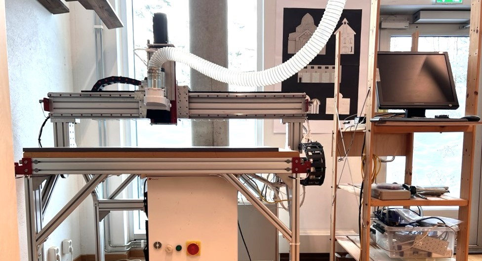

# Tangenåsen CNC
*Dokumentasjon av CNC fresen på Tangenåsen makerspace - AvidCNC 4x2*

### Indeks

- [Hva er en CNC fres](https://github.com/JensDyvik/Tangenaasen-CNC/tree/main#hva-er-en-cnc-fres)
- [Sikkerhet](https://github.com/JensDyvik/Tangenaasen-CNC/tree/main#sikkerhet)
- [Sjekkliste](https://github.com/JensDyvik/Tangenaasen-CNC/tree/main#sjekkliste)
- [Tutorial](https://github.com/JensDyvik/Tangenaasen-CNC/tree/main#tutorial-for-enkel-fresig)
- [Instillinger fresestål startpakke](https://github.com/JensDyvik/Tangenaasen-CNC/tree/main#instillinger-fresestål-startpakke)
- [Avansert bruk](https://github.com/JensDyvik/Tangenaasen-CNC/tree/main#avansert-bruk)
- [Om maskinen](https://github.com/JensDyvik/Tangenaasen-CNC/tree/main#om-maskinen)
- [Vedlikeholdsrutiner](https://github.com/JensDyvik/Tangenaasen-CNC/tree/main#vedlikeholdsrutiner)
- [Feilsøking](https://github.com/JensDyvik/Tangenaasen-CNC/tree/main#feilsøking)
- [Ressurser om fresing](https://github.com/JensDyvik/Tangenaasen-CNC/tree/main#ressurser-om-fresing)
- [To do på maskinen](https://github.com/JensDyvik/Tangenaasen-CNC/tree/main#to-do-på-maskinen)

### Hva er en CNC fres
*Kommer snart*

### Sikkerhet

**Mens du freser:**

- Ta aldri på maskinen eller materialet mens maskinen går
- Bruk vernebriller
- Bruk hørselsvern
- Ha på støvavsuget

### Sjekkliste

- Varm opp spindelen *(kjør i luften noen minutter)*
- Fest materialet til sengen
- Sett opp riktig skjæredybde, bit type og hastighet i CAM
- Home maskinen
- Sett i rikitg bit
- Koble til bit proben og probe bit lengden
- Koble fra bit proben
- Sjekk "work coordinates" og sett evt. ønsket nullpunkt for X og Y
- Sett på støvskjørtet og start avsuget
- Åpne jobben og start

Husk å forlate maskinen ryddigere enn du fant den

### Tutorial for enkel fresig
*Kommer snart*

### Instillinger fresestål startpakke

*Plungerate er alltid 2/3 av Feedrate*

**Treverk:**

- 2mm downcut, ett skjær - Feedrate: 1050mm/m, Passdepth: 2mm, Spindel RPM: 16000
- 3mm upcut, ett skjær - Feedrate: 1600mm/m, Passdepth: 6mm, Spindel RPM: 16000
- 4mm upcut, ett skjær - Feedrate: 2100mm/m, Passdepth: 9mm, Spindel RPM: 16000
- 6mm upcut, ett skjær - Feedrate: 3200mm/m, Passdepth: 14mm, Spindel RPM: 16000
- 6mm compression, ett skjær - Feedrate: 3200mm/m, Passdepth: 14mm, Spindel RPM: 16000 *(Husk ramp angle på 45 grader med compression bit, ikke mos rett ned i materialet)*
- 10mm upcut, to skjær - Feedrate: 8000mm/m, Passdepth: 10mm, Spindel RPM: 12000
- 10mm ballnose, to skjær - Feedrate: 8000mm/m, Passdepth: 6mm, Spindel RPM: 12000

**Plast:**

- 3mm upcut, ett skjær - Feedrate: 1100mm/m, Passdepth: 3mm, Spindel RPM: 16000
- 4mm upcut, ett skjær - Feedrate: 1400mm/m, Passdepth: 4mm, Spindel RPM: 16000
- 6mm upcut, ett skjær - Feedrate: 2100mm/m, Passdepth: 6mm, Spindel RPM: 16000

**Aluminium**

- 3mm upcut, ett skjær - Feedrate: 640mm/m, Passdepth: 0.3mm, Spindel RPM: 16000 *(Husk ramp angle på 8 grader, ikke mos rett ned i materialet)*
- 4mm upcut, ett skjær - Feedrate: 850mm/m, Passdepth: 0.4mm, Spindel RPM: 16000 *(Husk ramp angle på 8 grader, ikke mos rett ned i materialet)*
- 6mm upcut, ett skjær - Feedrate: 1280mm/m, Passdepth: 0.5mm, Spindel RPM: 16000 *(Husk ramp angle på 8 grader, ikke mos rett ned i materialet)*

### Avansert bruk

 - Gantry squaring finner man i menyen øverst på skjermen: Machine- Measure- Gantry Square

### Om maskinen

Maskinen ble kjøpt brukt høsten 2023. De makeaniske delene er fra et kit av typen ["PRO4824 4' x 2' CNC Router Machine"](https://www.avidcnc.com/pro4824-4-x-2-cnc-router-machine-p-1334.html) fra AvidCNC i USA. Kontrolleren er av typen [CNC USB controller Mk3](https://planet-cnc.com/hardware/) fra PlanetCNC i Tyskland. Motorene, driverene, spindelen og frekvensomformeren er fra diverse kinsesiske produsenter. Elektronikkskapet er bygget som et gjør-det-selv prosejkt av tidligere eier.

 - Arbeidsområde X-Y: 1220mm x ca 590mm
 - Vandring på Z akse: Ca 180mm *(det er mulig å skjære igjennom opptil ca 80mm tykke emner)*
 - Maks spindle turtall: 16500 RPM
 - Spindel effekt: ca 2kw
 - Type trinnmotorer: Nema34 closed loop *(mer enn nok skyvekraft)*
 - Lineærføringer: HGR15 linear rail *(billig type)*
 - Framdrift X-Y: Rack and pinion with 3:1 belt reduction and spring preoloaded pinon position
 - Framdrift Z: Kuleskrue
 - Steps per mm X-Y:
 - Steps per mm Z:

### Vedlikeholdsrutiner
*Kommer snart*

### Feilsøking
*Kommer snart*

### Ressurser om fresing
*Kommer snart*

### To do på maskinen

 - Forbedre maskin sikkerhet. E-stop + mer stabil arbeidsstasjon
 - Oppdater config backup
 - Legg på smørefett på venstre rack (Y akse)
 - Fyll på smørefett på alle guideblocks
 - Forebdre vedlkioholdsrutine
 
